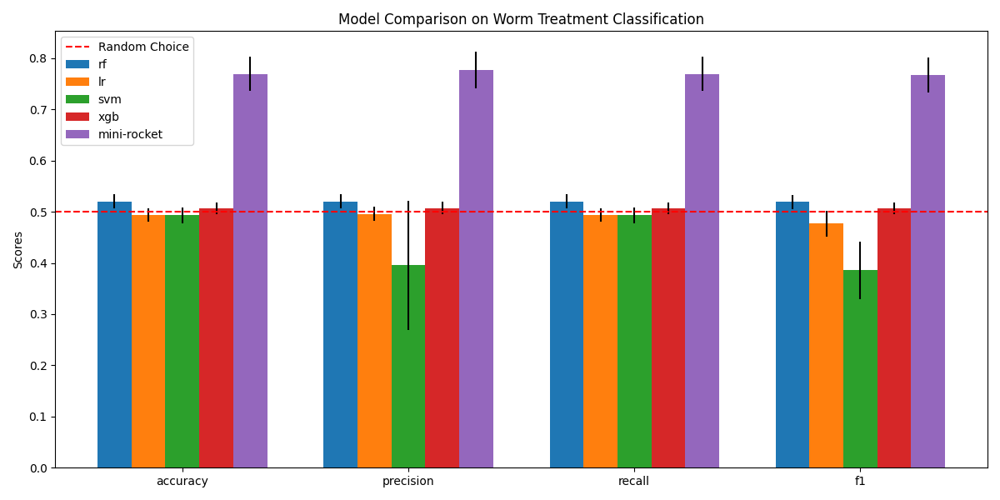

# Worm Classification ML Project

## Project Structure

```
project-2-astiflop/
│
├── preprocess.py
├── simple_classifier_utils.py
├── model_rocket.py
├── model_compare.py
├── data/
│   ├── lifespan_summary.csv
│   ├── TERBINAFINE- (control)/
│   └── TERBINAFINE+/
├── preprocessed_data/
│   ├── TERBINAFINE- (control)/
│   └── TERBINAFINE+/
├── preprocessed_data_for_classifier/
├── results_compare.json
├── results_rocket.json
├── results_comparison.ipynb
```

## File Descriptions

### Data Preparation

- **preprocess.py**  
  Cleans and preprocesses raw worm tracking CSV files.  
  - Renames files for consistency.
  - Drops invalid rows.
  - Segments time series.
  - Caps speed, normalizes coordinates, and interpolates gaps.
  - Produces cleaned files in `preprocessed_data/`.

- **simple_classifier_utils.py**  
  Converts preprocessed worm data into segment-level features for classification.  
  - Computes features (age, speed, displacement, tortuosity) per segment.
  - Aggregates and saves segment data for each worm in `preprocessed_data_for_classifier/`.

### Modeling

- **model_rocket.py**  
  Runs ROCKET (MiniRocketMultivariate) + Logistic Regression classification on time series data.
  For this model, we use the raw time series (X, Y, Speed) for each worm, padded so all worms have the same length. This allows us to "watch the worm's life in fast-forward"—each time series covers the full lifespan, aligned for model input.
  - Pads and transposes time series.
  - Optionally applies panel-wise standard scaling.
  - Aggregates predictions per worm.
  - Reports worm-level metrics and saves results to JSON.

#### How MiniRocket Works

MiniRocket applies thousands of random convolutional kernels to the time series data, extracting robust features that capture temporal patterns. These features are then used by a classifier (here, logistic regression) to distinguish between treated and control worms. MiniRocket is fast, scalable, and designed for time series classification.

- **model_compare.py**  
  Runs and compares multiple models (Random Forest, Logistic Regression, SVM, XGBoost) on segment-level features.  
  The features are the following: ```{
                "Segment": segment,
                "Age_hours": age_hours,
                "Mean_Speed": mean_speed,
                "Median_Speed": median_speed,
                "Net_Displacement": net_displacement,
                "Tortuosity": tortuosity,
    }```
  - Uses stratified group k-fold CV.
  - Applies StandardScaler for SVM and LR.
  - Aggregates metrics and feature importances.
  - Saves all results and parameters to `results_compare.json`.

### Notebooks

- **results_comparison.ipynb**  
  Loads JSON results and visualizes model performance (bar plots of metrics and std deviations).

### Outputs

- **results_compare.json**  
  Metrics and parameters for all models from `model_compare.py`.

- **results_rocket.json**  
  Metrics and parameters for ROCKET model from `model_rocket.py`.

## Typical Workflow

1. **Preprocessing:**  
   Run `preprocess.py` to clean and segment raw data.

2. **Feature Extraction:**  
   Run `simple_classifier_utils.py` to generate segment-level features.

3. **Model Training & Evaluation:**  
   - Run `model_rocket.py` for ROCKET.
   - Run `model_compare.py` to compare RF, LR, SVM, XGBoost.

4. **Results Analysis:**  
   Use `results_comparison.ipynb` to visualize and compare model performances.

## Data Leakage Prevention

Both in `model_rocket.py` and `model_compare.py`, there is no risk of validation leakage. For each cross-validation fold, all data from a given worm is kept together—either as a full time series (ROCKET) or as all its segments (feature-based models). This guarantees that no worm is split between training and test sets, so the model never sees partial information from the same worm in both sets. This strict grouping ensures robust and fair evaluation.

## Model Comparison Visualization

At the end of your analysis, you can find a summary bar plot comparing all models in `model_comparison.png`:



