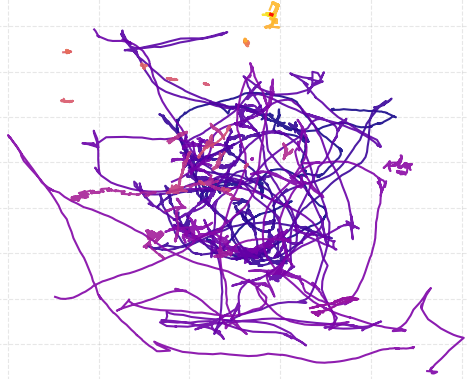
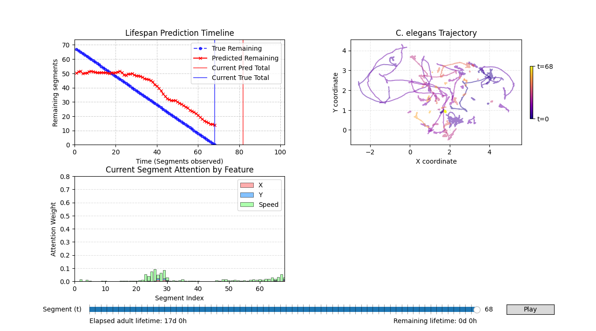

<div class="gradient-pill mb-4">Data Science Semester Project</div>

# Leveraging Machine Learning 
# to Estimate *C. Elegans* Lifespan

<div class="subtitle text-xl mt-4 font-normal opacity-90">
  From simple movements, to remaining lifespan
</div>

---
layout: default
class: slide-bg-1
---

<!-- Slide 2 — Group presentation -->

# A little word on us

<div class="team-grid mt-8 max-w-2xl mx-auto">

<div class="glass-card p-6 text-center">
  <div class="font-semibold text-lg">Eugène Bergeron</div>
  <div class="text-sm opacity-70">Artificial Life, Biology</div>
</div>

<div class="glass-card p-6 text-center">
  <div class="font-semibold text-lg">Massimo Berardi</div>
  <div class="text-sm opacity-70">Financial Engineering, Health</div>
</div>

</div>

---
layout: default
class: slide-bg-2
---

<!-- Slide 3 — Intro: the task -->

# The Task

<div class="flex flex-col items-center justify-center mt-10">

  <div class="glass-card p-5 max-w-xl text-left">

  ### Primary goal
  Estimate **remaining lifespan** from movement time series alone. From the **raw graph** generated by the worm's movements, estimate the time before its death.

  </div>

</div>

<div class="flex items-center justify-center mt-10">

  <!-- Trajectory image -->
  <div>
    
    <div class="mt-2 text-xs text-gray-600 opacity-80">Trajectory of the worm</div>
  </div>

  <!-- Arrow -->
  <div class="mx-10 flex items-center">
    <svg width="75" height="40" viewBox="0 0 60 40" fill="none" xmlns="http://www.w3.org/2000/svg">
      <line x1="5" y1="20" x2="55" y2="20" stroke="#888" stroke-width="3" marker-end="url(#arrowhead)" />
      <defs>
        <marker id="arrowhead" markerWidth="7" markerHeight="7" refX="3.5" refY="3.5" orient="auto">
          <polygon points="0 0, 7 3.5, 0 7" fill="#888"/>
        </marker>
      </defs>
    </svg>
  </div>

  <!-- Gear/model box with emoji -->
  <div class="flex flex-col items-center">
    <div class="bg-white shadow-lg border border-gray-200 rounded-lg flex items-center justify-center text-3xl" style="width: 64px; height: 64px;">
      🛠️
    </div>
    <div class="mt-2 text-xs text-gray-600 opacity-80">Model</div>
  </div>

  <!-- Arrow -->
  <div class="mx-10 flex items-center">
    <svg width="75" height="40" viewBox="0 0 60 40" fill="none" xmlns="http://www.w3.org/2000/svg">
      <line x1="5" y1="20" x2="55" y2="20" stroke="#888" stroke-width="3" marker-end="url(#arrowhead2)" />
      <defs>
        <marker id="arrowhead2" markerWidth="7" markerHeight="7" refX="3.5" refY="3.5" orient="auto">
          <polygon points="0 0, 7 3.5, 0 7" fill="#888"/>
        </marker>
      </defs>
    </svg>
  </div>

  <!-- Lifespan box -->
  <div>
    <div class="bg-white shadow-lg border border-gray-200 rounded-lg flex items-center justify-center px-5 py-6 text-center">
      <span class="text-xl font-semibold text-gray-900">2 days, 5 hours</span>
    </div>
    <div class="mt-2 text-xs text-gray-600 opacity-80">Predicted Remaining Life</div>
  </div>

</div>


---
layout: default
class: slide-bg-3
---

<!-- Slide 4 — Terbinafine classification -->

# Terbinafine Classification

<div class="text-left mt-2 mb-4 text-sm opacity-90 max-w-4xl">
Based only on the raw trajectories, can we guess if a worm is being treated with <strong>Terbinafine</strong>?
</div>

<div class="grid grid-cols-2 gap-8 text-left items-start max-w-5xl mx-auto">

<div class="text-xs uppercase tracking-wide opacity-60 font-semibold grid grid-cols-[1.4fr_1fr_0.6fr] gap-3 border-b border-gray-300/50 pb-2">
  <span>Approach</span>
  <span>Rawness / Transparency</span>
  <span class="text-right">Accuracy</span>
</div>

<div class="text-xs uppercase tracking-wide opacity-60 font-semibold border-b border-gray-300/50 pb-2">
  Description
  <br>
<span style="opacity:0">a</span>
</div>

</div>

<v-clicks>

<div class="grid grid-cols-2 gap-8 text-left items-start max-w-5xl mx-auto mt-3">

<div class="grid grid-cols-[1.4fr_1fr_0.6fr] gap-3 px-4 py-3 items-center">
  <span class="font-semibold">Computer Vision</span>
  <span class="italic opacity-80">good</span>
  <span class="text-right font-mono">58%</span>
</div>

<div class="text-sm leading-relaxed pt-1">
  CNN-based model applied on a rendered image of the trajectory.
</div>

</div>

<div class="grid grid-cols-2 gap-8 text-left items-start max-w-5xl mx-auto mt-3">

<div class="grid grid-cols-[1.4fr_1fr_0.6fr] gap-3 px-4 py-3 items-center">
  <span class="font-semibold">Feature Extraction</span>
  <span class="italic opacity-80">mixed</span>
  <span class="text-right font-mono">65%</span>
</div>

<div class="text-sm leading-relaxed pt-1">
  Hand-crafted features like angular velocities, tendencies, tortuosity, etc., fed to an estimator.
</div>

</div>

<div class="grid grid-cols-2 gap-8 text-left items-start max-w-5xl mx-auto mt-3">

<div class="grid grid-cols-[1.4fr_1fr_0.6fr] gap-3 px-4 py-3 items-center">
  <span class="font-semibold">Time series segmentation</span>
  <span class="italic opacity-80" style="color:green">excellent</span>
  <span class="text-right font-mono" style="color:green">76%</span>
</div>

<div class="text-sm leading-relaxed pt-1">
  Segment the raw data into fixed-length windows, fed directly in an estimator.
</div>

</div>

</v-clicks>

---
layout: default
class: slide-bg-4
---

<!-- Slide 5 — Preprocessing -->

# Preprocessing Pipeline

<div class="text-sm mb-4 opacity-80">
  Click through to see how we go from raw recording to model-ready tensors
</div>

<PreprocessingFlow />

<!--
Animation: each click reveals the next stage of the pipeline,
ending with the (B, T, V, L) tensor shape explanation.
-->

---
layout: default
class: slide-bg-5 slide-code-sm slide-feature-extract
---

<!-- Slide 6 — Feature extraction -->

# Architecture (1/3)
## Feature Extraction

<div class="grid grid-cols-2 gap-5 text-left items-start feat-slide-grid">

<div class="flex flex-col gap-2 text-sm">

<div>
Each <strong>segment</strong> (900 frames) yields variates <strong>X, Y, Speed, Lifetime</strong> — we encode one branch at a time.
</div>

<div v-click="1">
A <strong>1D CNN</strong> slides convolution kernels over the raw signal; receptive field grows layer by layer.
</div>

<!-- <div v-click="3">
<strong>Max-pool + FC</strong> compress each variate into a fixed <strong>128-d embedding</strong>.
</div>

<div v-click="3" class="text-xs opacity-80">
Identical CNN branch <strong>×3</strong> for X, Y &amp; Speed — fused downstream by attention.
</div> -->

<NotebookLink />

</div>

<div class="feat-diagram-col">
<FeatureExtractionDiagram />
</div>

</div>

```python
# CNNFeatureExtractor: (B, 1, 900) → (B, 128)
Conv1d(1→32,k=7,s=2) → Conv1d(32→64,k=5,s=2) → Conv1d(64→128,k=3,s=2) → MaxPool → FC
```

---
layout: default
class: slide-bg-6 slide-code-sm slide-attention-extract
---

<!-- Slide 7 — Attention aggregation -->

# Architecture (2/3)
## Attention Aggregation

<div class="grid grid-cols-2 gap-5 text-left items-start feat-slide-grid">

<div class="flex flex-col gap-2 text-sm">


<div>
CNN embeddings for <strong>X, Y, Speed</strong> are reshaped to <i>(B·T, 3, embed_dim)</i> — three variates per segment.
</div>

<div v-click="1">
<strong>Gated attention</strong> scores each variate.
</div>

<div v-click="2">
Weighted sum yields the <strong>seg_emb</strong>; <strong>Lifetime</strong> is sinusoidally encoded and added after the aggregation.
</div>

</div>

<div class="feat-diagram-col">
<AttentionAggregationDiagram />
</div>

</div>


---
layout: default
class: slide-bg-1
---

<!-- Slide 8 — Temporal modules -->

# Architecture (3/3)
## Temporal Modules — the processing unit

<ArchitectureDiagram stage="temporal" />

<br>
<br>

- Both produce a **sequence of enriched embeddings** fed to segment-level attention


---
layout: two-cols
layoutClass: gap-6
class: slide-bg-2
---

<!-- Slide 9 — Staircase training -->

# Training Specificities
<div v-click="1">

## 1. Worm level validation split
</div>
<div v-click="2">

## 2. Data augmentation 
</div>
<div v-click="3">

## 3. Staircase sampling
</div>
<div v-click="4">

## 4. Scalar vs. distribution prediction
</div>
<div v-click="4">

## 5. Training objective
</div>

::right::
<div v-click="1">
  <div class="glass-card flex items-start gap-4 p-2 pb-0 mb-1">
    <div class="card-num text-m font-bold bg-blue-900 text-white rounded-full w-6 h-6 flex items-center justify-center">1</div>
    <div>
      <div class="font-semibold mb-1">Preventing data leakage</div>
      <pre class="bg-transparent whitespace-pre mb-0 mt-0 p-0 text-xs" style="font-family: inherit;">
All segments related to a worm are in one of the split
      </pre>
    </div>
  </div>
</div>

<div v-click="2">
  <div class="glass-card flex items-start gap-4 p-2 pb-0 mb-1">
    <div class="card-num text-m font-bold bg-blue-900 text-white rounded-full w-6 h-6 flex items-center justify-center ">2</div>
    <div>
      <div class="font-semibold mb-1">From 1 trajectory, create 5 differents</div>
      <pre class="bg-transparent whitespace-pre mb-0 mt-0 p-0 text-xs" style="font-family: inherit;">
A tool against overfittings:
- Scaling
- Rotation
- Offsets
      </pre>
    </div>
  </div>
</div>

<div v-click="3">
  <div class="glass-card flex items-start gap-4 p-2 pb-0 mb-1">
    <div class="card-num text-m font-bold bg-blue-900 text-white rounded-full w-6 h-6 flex items-center justify-center">3</div>
    <div>
      <div class="font-semibold mb-1">Sample <strong>prefixes</strong> of a worm's life:</div>
      <pre class="bg-transparent whitespace-pre mb-0 mt-0 p-0 text-xs" style="font-family: inherit;">
Segment 1            → predict remaining
Segments 1–2     → predict remaining
       ⋮
Segments 1–T     → predict remaining
      </pre>
    </div>
  </div>
</div>

<div v-click="4">
  <div class="glass-card flex items-start gap-4 p-2 pb-0 mb-1">
    <div class="card-num text-m font-bold bg-blue-900 text-white rounded-full w-6 h-6 flex items-center justify-center">4</div>
    <div>
      <div class="font-semibold mb-1">Predicting distribution parameters</div>
      <pre class="bg-transparent whitespace-pre mb-0 mt-0 p-0 text-xs" style="font-family: inherit;">
Several options have been explored:
- Direct scalar prediction
- Gaussian distribution
- Weibull distribution
      </pre>
    </div>
  </div>
</div>
<div v-click="5">
  <div class="glass-card flex items-start gap-4 p-2 pb-0 mb-1">
    <div class="card-num text-m font-bold bg-blue-900 text-white rounded-full w-6 h-6 flex items-center justify-center">5</div>
    <div>
      <div class="font-semibold mb-1">Training objective</div>
      <pre class="bg-transparent whitespace-pre mb-0 mt-0 p-0 text-xs" style="font-family: inherit;">
Instead of trying to predict directly the full lifespan, the model 
is only trained to predict the correct value on the last 50 segments. 
      </pre>
    </div>
  </div>
</div>


---
layout: default
class: slide-bg-3
---

<!-- Slide 10 — Benchmark results -->

# Benchmark Results

<div class="text-sm mb-3 opacity-80">

</div>

<div class="glass-card p-3 text-left overflow-x-auto">

<table class="w-full text-xs border-collapse">
<thead>
<tr class="border-b border-gray-300/50 opacity-70">
  <th class="text-left py-1 pr-2 font-semibold">Model</th>
  <th class="text-center py-1 px-1 font-semibold">MAE</th>
  <th class="text-center py-1 px-1 font-semibold">T1</th>
  <th class="text-center py-1 px-1 font-semibold">T2</th>
  <th class="text-center py-1 px-1 font-semibold">T3</th>
  <th class="text-center py-1 px-1 font-semibold">CRPS</th>
  <th class="text-center py-1 px-1 font-semibold">Cov.</th>
  <th class="text-center py-1 px-1 font-semibold">Early.</th>
  <th class="text-center py-1 px-1 font-semibold">NLL</th>
  <th class="text-center py-1 pl-1 font-semibold">Sharp.</th>
</tr>
</thead>
<tbody class="font-mono">

<tr class="opacity-60">
  <td class="py-1 pr-2 font-sans">Random guess</td>
  <td class="text-center px-1">51.8</td>
  <td class="text-center px-1">40.9</td>
  <td class="text-center px-1">49.0</td>
  <td class="text-center px-1">64.9</td>
  <td class="text-center px-1">51.0</td>
  <td class="text-center px-1">3.7%</td>
  <td class="text-center px-1">0.0</td>
  <td class="text-center px-1">1015.2</td>
  <td class="text-center pl-1">5.5</td>
</tr>

<tr class="opacity-60">
  <td class="py-1 pr-2 font-sans">Average guessing</td>
  <td class="text-center px-1">7.2</td>
  <td class="text-center px-1">7.2</td>
  <td class="text-center px-1">7.2</td>
  <td class="text-center px-1">7.2</td>
  <td class="text-center px-1">6.4</td>
  <td class="text-center px-1">21.1%</td>
  <td class="text-center px-1">27.6</td>
  <td class="text-center px-1">21.5</td>
  <td class="text-center pl-1">5.5</td>
</tr>

<tr class="border-t border-gray-300/30">
  <!-- <td class="py-1 pr-2 font-sans font-semibold" style="color:#15803d">tcn_do-15_5ks ★</td> -->
  <td class="py-1 pr-2 font-sans font-semibold" style="color:#15803d">TCN + Weibull ★</td>
  <td class="text-center px-1 font-semibold" style="color:#15803d">9.7</td>
  <td class="text-center px-1">9.1</td>
  <td class="text-center px-1">7.9</td>
  <td class="text-center px-1">12.0</td>
  <td class="text-center px-1">6.7</td>
  <td class="text-center px-1 font-semibold" style="color:#15803d">96.7%</td>
  <td class="text-center px-1">46.7</td>
  <td class="text-center px-1">3.9</td>
  <td class="text-center pl-1">48.8</td>
</tr>

<tr>
  <td class="py-1 pr-2 font-sans">TCN Gaussian</td>
  <td class="text-center px-1">11.8</td>
  <td class="text-center px-1">8.4</td>
  <td class="text-center px-1">9.7</td>
  <td class="text-center px-1">17.1</td>
  <td class="text-center px-1">8.1</td>
  <td class="text-center px-1">91.7%</td>
  <td class="text-center px-1">48.4</td>
  <td class="text-center px-1">4.1</td>
  <td class="text-center pl-1">50.3</td>
</tr>

<tr>
  <td class="py-1 pr-2 font-sans">BiLSTM Scalar</td>
  <td class="text-center px-1">13.2</td>
  <td class="text-center px-1">7.8</td>
  <td class="text-center px-1">10.3</td>
  <td class="text-center px-1">21.2</td>
  <td class="text-center px-1">12.5</td>
  <td class="text-center px-1">11.1%</td>
  <td class="text-center px-1">50.2</td>
  <td class="text-center px-1">66.4</td>
  <td class="text-center pl-1">5.5</td>
</tr>

<tr>
  <td class="py-1 pr-2 font-sans">BiLSTM Gaussian</td>
  <td class="text-center px-1">14.4</td>
  <td class="text-center px-1">9.3</td>
  <td class="text-center px-1">11.4</td>
  <td class="text-center px-1">22.1</td>
  <td class="text-center px-1">11.3</td>
  <td class="text-center px-1">54.1%</td>
  <td class="text-center px-1">48.8</td>
  <td class="text-center px-1">5.4</td>
  <td class="text-center pl-1">30.1</td>
</tr>

</tbody>
</table>

</div>

<div class="grid grid-cols-3 gap-3 mt-3 text-xs text-left">

<div class="glass-card p-2">
  <strong>Best ML model:</strong> TCN 5k steps, with MAE of ~10 segments, corresponding to ~2.5 day. In the dataset, the interval is from 10 to 37 days, with the mean at 15.  
</div>

<div class="glass-card p-2">
  <strong>Tier MAE (T1/T2/T3):</strong> early / mid / late remaining lifespan.
</div>

<div class="glass-card p-2">
  The <strong>Weibull distribution</strong> has been the breakthrough needed to get to the 95% Confidence Interval.
</div>

</div>

---
layout: default
class: slide-bg-4
---

<!-- Slide 11 — Visualization -->

# Visualization

<div class="flex items-center justify-center pt-2">
  
</div>

---
layout: default
class: slide-bg-5
---

<!-- Slide 12 — Interpretability -->

# Interpretability

<div class="attention-demo mt-4">

<div class="text-left">


**Key finding:** 

<v-click>

- Speed is the main attended variate  

</v-click>

<v-click>

- The prediction tilts downward after several low-speed "sentinel" segments  

</v-click>

<v-click>

- Low-speed segments have higher attention weights  

</v-click>

<div v-click class="glass-card p-3 mt-4 text-sm">

As time grows, attention concentrates on late-life low-movement segments comparing them to sentinel segments in early life.

</div>

</div>

<div>


</div>

</div>

---
layout: default
class: slide-bg-6
---

<!-- Slide 13 — Conclusion -->

# Conclusion

<div class="conclusion-list text-left max-w-3xl mx-auto mt-6 text-lg">

<v-click>

- Remaining lifespan can be predicted from raw trajectories only

</v-click>

<v-click>

- The lifespan data is rich enough to be predicted agnostically of the model architecture

</v-click>

<v-click>

- Achieving predictions given the dataset size shows the importance of a foundation model approach

</v-click>

</div>


---
layout: center
class: slide-bg-cover text-center
---

<!-- Slide 14 — Thanks -->

# Thank you for you attention!

<div class="subtitle text-2xl mt-4 font-normal opacity-90">
  Any questions?
</div>
